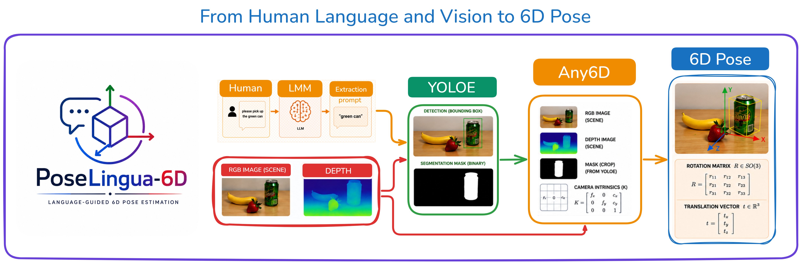

<p align="center">
  
</p>
# Open Vocabulary 6D Object Pose Estimation - Model-Free

Research project exploring open-vocabulary object detection and 6D pose estimation by combining YOLOE with model-free pose estimation methods for robotic manipulation of unseen objects.
## Tools
- Python
- PyTorch
- Basic Math: Linear algebra (transformation matrices) and deep learning fundamentals
- Asset: Experience with CUDA and OpenCV
---

## Project Description

In this project, we  will integrate a state-of-the-art object detection method with a pose estimation framework to determine the **6D pose of novel objects**. The proposed detection method is **YOLOE**, a real-time open-vocabulary detector that identifies objects based on vision and simple text prompts. The YOLOE model is publicly available and ready to be used as is.The primary technical challenge is using YOLOE in a **"frozen" (off-the-shelf)** manner to drive a downstream **6D pose estimator**.

The pipeline will work as follows:

1. **YOLOE detection**
   - YOLOE detects the precise **2D location** and **segmentation** of an object based on a user's text prompt.

2. **Pose estimation**
   - This 2D output will serve as the input for a **model-free pose estimation method** (such as Any6D).

3. **6D pose regression**
The pose estimator will regress the object’s 6D pose: This capability is critical in robotics for the accurate manipulation of unseen objects.
---

## Project Phases
The project includes the following phases:

### 1. Understanding key concepts
- Pose estimation in computer vision
- Basic math behind pose estimation
- Matrix conversions
- How the pre-trained YOLOE model works

### 2. Selecting a pose estimation method
- Example: **Any6D**
- Study and understand its implementation and code

### 3. Building the pipeline
- Connect the **YOLOE detection output** to the **pose estimation pipeline**
- Produce a **6D pose result**

The pipeline will be validated by:
- Providing an **image input**
- Running the model
- **Verifying the predicted 6D pose**
---
# Reading Schedule

| Date | Paper | Notes |
|------|-------|--------|
| 14-03-2026 | [Deep Learning-Based Object Pose Estimation: A Comprehensive Survey](https://arxiv.org/pdf/2405.07801) | [Notes](notes/pose_estimation_review_2024.md) |
| 16-03-2026 | [A Survey of 6DoF Object Pose Estimation Methods for Different Application Scenarios](https://www.mdpi.com/1424-8220/24/4/1076) | [Notes](notes/pose_estimation_review_mdpi.md) |
| 18-03-2026 |  [YOLOE: Real-Time Open-Vocabulary Object Detection](https://arxiv.org/pdf/2503.07465) |  [Notes](notes/yoloe_paper.md) |
| 20-03-2026 |  [Ultralytics YOLO Docs](https://docs.ultralytics.com/models/yoloe/) |  [Notes](notes/yoloe_documentation.md) |
| 22-03-2026 |  [Any6D: Model-free 6D Pose Estimation of Novel Objects CVPR 2025](https://sites.google.com/view/taeyeop-lee/any6d) |  [Notes](notes/any6d_paper.md) |
| 24-03-2026 | [Any6D ](https://github.com/taeyeopl/any6d) |  [Notes](notes/any6d_code.md) |


## Tasks
-  Setup  of master's project workflow 

- installation of requirement [ python 3.11.8 , Vitual environment "venv" , install git + gcloud sdk and vs code extensions (pylance , jupyter, remote -ssh, remote explorer , git lens, github copilot ) ]

- package : Install pytorch (CUDA 12.1) for GCP T4 /100 drivers, and scientific + utility packages

## Installation of YOLOE

To get started, clone the repository.
---

### Clone the project

```bash
git clone https://github.com/josue-do-it/open-vocabulary-6d-pose-yoloe.git
cd open-vocabulary-6d-pose-yoloe
```

---

Then create the environment and install all required packages by running:

```bash
chmod +x setup_master_env.sh
bash setup_master_env.sh


# Activate environment
source master_env/bin/activate
```

This script creates a Python virtual environment called `master_env` and installs the core dependencies:


## Setup & Installation Any6D

### 1. Clone & Download Weights


Clones the Any6D repository, creates checkpoint directories, and downloads the required model weights (SAM2, InstantMesh, FoundationPose).

```bash
chmod +x setup_any6d.sh
bash setup_any6d.sh
```

### 2. Build Docker Image


Creates the `docker-compose.yml` if it doesn't exist, configures CUDA architecture for NVIDIA L4 (8.9), and builds the Any6D Docker image.

```bash
chmod +x build_any6d.sh
bash build_any6d.sh
```

---


## Project Structure

```
open-vocabulary-6d-pose-yoloe/
├── Any6D/                          # 6D pose estimation module
│   ├── foundationpose/             # FoundationPose model
│   │   └── weights/
│   │       ├── 2024-01-11-20-02-45/
│   │       └── 2023-10-28-18-33-37/
│   ├── sam2/
│   │   └── checkpoints/
│   │       └── sam2.1_hiera_large.pt
│   ├── instantmesh/
│   │   └── ckpts/
│   │       ├── diffusion_pytorch_model.bin
│   │       └── instant_mesh_large.ckpt
│   ├── Dockerfile
│   └── docker-compose.yml
├── notebooks/                      # Jupyter notebooks
├── images/                         # Test images
├── master_env/                     # Python virtual environment
├── setup_master_env.sh             # Setup script for YOLOE env
├── setup_any6d.sh                  # Setup script for Any6D + Docker
└── README.md
```

---

## Requirements

### System
- Ubuntu 22.04
- NVIDIA GPU (L4 / T4 / RTX 30xx+)
- CUDA 12.1+
- Docker + NVIDIA Container Toolkit
- Python 3.10+

### Cloud (Recommended)
- Google Cloud VM with NVIDIA L4 GPU
- Machine type: `g2-standard-4` (4 vCPUs, 16GB RAM, 24GB VRAM)

---

## Installation

### Step 1 — Install Docker on the VM

```bash
sudo apt-get update && sudo apt-get install -y docker.io docker-compose-v2
sudo systemctl start docker && sudo systemctl enable docker
sudo usermod -aG docker $USER
newgrp docker

# NVIDIA Container Toolkit
curl -fsSL https://nvidia.github.io/libnvidia-container/gpgkey | sudo gpg --dearmor -o /usr/share/keyrings/nvidia-container-toolkit-keyring.gpg
curl -s -L https://nvidia.github.io/libnvidia-container/stable/deb/nvidia-container-toolkit.list \
  | sed 's#deb https://#deb [signed-by=/usr/share/keyrings/nvidia-container-toolkit-keyring.gpg] https://#g' \
  | sudo tee /etc/apt/sources.list.d/nvidia-container-toolkit.list
sudo apt-get update && sudo apt-get install -y nvidia-container-toolkit
sudo nvidia-ctk runtime configure --runtime=docker
sudo systemctl restart docker

# Verify GPU
docker run --rm --gpus all nvidia/cuda:12.1.1-base-ubuntu22.04 nvidia-smi
```


### Step 3 — Setup  environment

```bash
# Install python3-venv if needed
sudo apt install python3.10-venv -y

```

---

## Usage

### YOLOE — Open Vocabulary Detection

```bash
source master_env/bin/activate
jupyter lab --ip=0.0.0.0 --port=8888 --no-browser
```

Open `notebooks/YOLOE_notebook.ipynb` in Jupyter.

---

### Any6D — 6D Pose Estimation

```bash
cd Any6D
docker compose run --rm any6d python run_demo.py
```

---

### Full Pipeline — YOLOE + Any6D

```bash
source master_env/bin/activate
jupyter lab --ip=0.0.0.0 --port=8888 --no-browser
```

Open `notebooks/YOLOE_Any6D_Pipeline.ipynb` in Jupyter.

---

## Checkpoints

Download manually if the setup script fails:

| Model | Source | Destination |
|---|---|---|
| FoundationPose weights | [Google Drive](https://drive.google.com/drive/folders/1DFezOAD0oD1BblsXVxqDsl8fj0qzB82i) | `Any6D/foundationpose/weights/` |
| SAM2 | [Meta AI](https://dl.fbaipublicfiles.com/segment_anything_2/092824/sam2.1_hiera_large.pt) | `Any6D/sam2/checkpoints/` |
| InstantMesh | [HuggingFace](https://huggingface.co/TencentARC/InstantMesh/tree/main) | `Any6D/instantmesh/ckpts/` |

---

## GPU Architecture Reference

| GPU | Compute Capability | TORCH_CUDA_ARCH_LIST |
|---|---|---|
| NVIDIA L4 | 8.9 | `8.9` |
| NVIDIA T4 | 7.5 | `7.5` |
| RTX 3090 / A100 | 8.6 | `8.6` |
| Quadro M1000M | 5.0 | `5.0` |

---

## Troubleshooting

**`libGL.so.1` not found:**
```bash
sudo apt-get install -y libgl1-mesa-glx libglib2.0-0
```

**`pkg_resources` not found during Docker build:**
Already fixed in Dockerfile — `setuptools==69.5.1` is installed before `requirements.txt`.

**`Permission denied (publickey)` for VS Code Remote SSH:**
```powershell
icacls "C:\Users\ADMIN\.ssh\config" /inheritance:r
icacls "C:\Users\ADMIN\.ssh\config" /grant:r "JOSUE\ADMIN:F"
```

**Docker build fails with CUDA error:**
Make sure `TORCH_CUDA_ARCH_LIST` matches your GPU in the Dockerfile.

---

---

## Testing the Pipeline — Step by Step

After cloning and completing the setup above, follow these steps to run the full pipeline.

### Prerequisites

Make sure the following are running before any test:

```bash
# 1. Start the Any6D Docker container (detached)
cd Any6D
docker compose up -d

# 2. Start Ollama with Mistral (LLM keyword extractor)
ollama serve &
ollama pull mistral:latest

# 3. Activate the Python environment
source ../master_env/bin/activate
```

---

### Test 1 — Real-world inference (single image + LiDAR)

Uses the included `bottle.jpg` and `bottle.ply` (iPhone 13 Pro LiDAR capture).

```bash
docker exec any6d_active python /workspace/infer_pose_single.py \
    --image  /workspace/test_input/bottle.jpg \
    --ply    /workspace/test_input/bottle.ply \
    --instruction "Please hand me the bottle" \
    --out_dir /workspace/results/infer_pose_bottle
```

**Expected output:**
```
[LLM] keyword: "bottle"
[YOLOE] conf=0.914  n_pts=2607
Pose saved → /workspace/results/infer_pose_bottle/bottle_pose.json
  T = [-0.425  0.525  1.684] m   |T| = 1.815 m
```

Then generate the publication figure:

```bash
docker exec any6d_active python /workspace/replot_infer_pose.py \
    --json /workspace/results/infer_pose_bottle/bottle_pose.json \
    --img  /workspace/test_input/bottle.jpg \
    --ply  /workspace/test_input/bottle.ply \
    --out_dir /workspace/results/infer_pose_bottle/report_plots
```

---

### Test 2 — Full pipeline on HO3D (one sequence)

Runs LLM → YOLOE → Any6D → BOP metrics on a single HO3D sequence.

```bash
# Inside Docker
docker exec any6d_active python /workspace/run_full_pipeline_ho3d.py \
    --seq AP13 \
    --dataset_root /dataset/ho3d \
    --out_dir /workspace/results/ho3d_pipeline/test_run \
    --llm_model mistral:latest
```

**Expected metrics (AP13):**
```
ADD-S : 100.0%   ADD : 57.5%   AR : 48.6%
Det   :  100%    IoU : 93.8%   T_error : 2.1 cm
```

To run all 13 sequences at once:

```bash
chmod +x Any6D/run_full_pipeline_ho3d_loop.sh
bash Any6D/run_full_pipeline_ho3d_loop.sh
```

---

### Test 3 — YOLOE + Any6D baseline (no LLM)

Runs Any6D with YOLOE masks directly, without the LLM keyword extractor.

```bash
docker exec any6d_active python /workspace/run_yoloe_ho3d_query.py \
    --seq SM1 \
    --dataset_root /dataset/ho3d \
    --out_dir /workspace/results/ho3d_results/any6d_yoloe/test_run \
    --prompt "mustard bottle"
```

---

### Test 4 — Generate comparison figures

After running both pipelines, regenerate the comparison table and delta plots:

```bash
# Outside Docker (master_env)
cd Any6D
python plot_comparison_table.py
# Output: results/pipeline_plots/comparison_table.png
#         results/pipeline_plots/comparison_delta.png
```

---

### Test 5 — 3D bounding box projection

Project the estimated 3D bounding box onto the image:

```bash
docker exec any6d_active python /workspace/plot_bbox3d.py \
    --json /workspace/results/infer_pose_bottle/bottle_pose.json \
    --img  /workspace/test_input/bottle.jpg \
    --out  /workspace/results/infer_pose_bottle/bottle_bbox3d.png
```

---

### Expected Results Summary

Evaluation on **HO3D dataset — 13 sequences, ~2 012 frames total**.
GPU: NVIDIA L4 (23 GB VRAM). All models off-the-shelf, no fine-tuning.

#### Comparison with state-of-the-art (Any6D paper — Table 1)

| Method | Modality | ADD-S | ADD | AR |
|---|---|---|---|---|
| Oryon [11] | RGB-D + Language | 23.0 | 0.0 | 1.0 |
| LoFTR [59] | RGB-D | 29.5 | 2.3 | 3.2 |
| Gedi [53] | Depth | 71.9 | 9.7 | 7.4 |
| Any6D *(paper, oracle masks)* | RGB-D | **98.7** | **40.4** | **38.3** |
| YOLOE + Any6D *(ours, no LLM)* | RGB-D | 74.4 | 24.1 | 30.6 |
| **LLM + YOLOE + Any6D *(ours)*** | RGB-D + Language | **89.6** | **28.7** | **37.6** |

> Oryon is the only other language-guided baseline (RGB-D + Language).
> Our pipeline outperforms Oryon by **+66.6 pp ADD-S** and **+36.6 pp AR**,
> while remaining competitive with Any6D oracle (−9.1 pp ADD-S) without any CAD model or fine-tuning.

---

## References

- [Any6D](https://github.com/taeyeopl/Any6D)
- [YOLOE](https://github.com/THU-MIG/yoloe)
- [FoundationPose](https://github.com/NVlabs/FoundationPose)
- [SAM2](https://github.com/facebookresearch/segment-anything-2)
- [InstantMesh](https://huggingface.co/TencentARC/InstantMesh)
